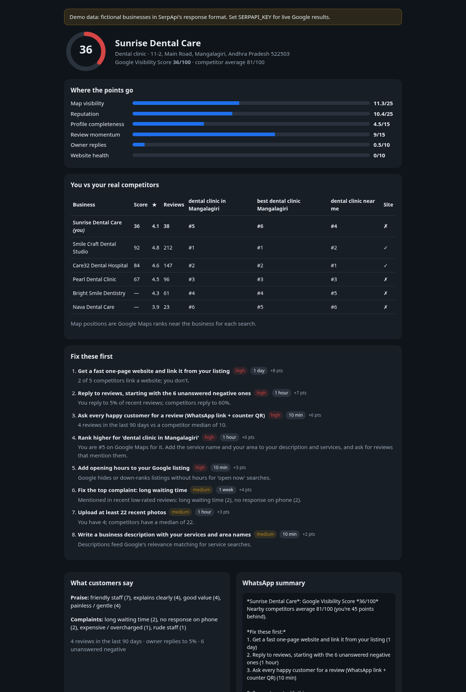
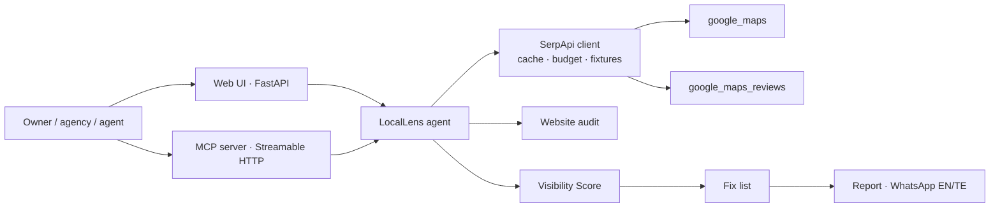

# LocalLens

**Why is this shop losing to its neighbours on Google, and what should it fix first?**

India has more than 60 million small businesses, and for clinics, gyms, coaching centres, bakeries and boutiques,
"near me" searches on Google Maps decide who gets the walk-in. The owner can see they're behind. They can't see
*why*, or what to fix first.

LocalLens is an **AI agent** that plans, searches, compares and acts on live search data from **SerpApi**:

1. **Resolves** the business on Google Maps (`google_maps`, search + place details).
2. **Finds its real competitors**: the businesses Google actually ranks around its coordinates (`google_maps` with `ll`).
3. **Tracks rank** for three real intent searches ("dental clinic in Mangalagiri", "best dental clinic Mangalagiri", "dental clinic near me").
4. **Reads reviews** for the business and its top 3 competitors (`google_maps_reviews`): 90-day velocity, owner-reply rate,
   unanswered negatives, and what customers praise or complain about.
5. **Audits the website** linked from the listing (HTTPS, mobile, speed, SEO basics).
6. **Scores** everything into a transparent **Visibility Score (0–100)**, side by side with each competitor.
7. **Acts**: a prioritised fix list where every fix cites its evidence ("You reply to 5% of reviews; competitors reply to 60%"),
   a shareable report, and a **WhatsApp-ready summary in English and Telugu**.

It also has a **Scan-an-area** mode for web agencies and consultants (one search → every business in a category, ranked by
fixable gap), and an **MCP server** so any agent (Claude, Alexa+, IDE agents) can call it as a tool.



## Quick start (≤ 5 commands)

```bash
git clone <repo-url> locallens && cd locallens
python3 -m venv .venv && . .venv/bin/activate
pip install -r requirements.txt
export SERPAPI_KEY=your_key            # optional: without it LocalLens runs on labelled demo data
uvicorn locallens.web.app:app --port 8000     # open http://localhost:8000
```

MCP server (Streamable HTTP, spec 2025-11-25): `python -m locallens.mcp_server` → `http://127.0.0.1:8765/mcp`,
then `python examples/mcp_client.py`. Tests: `pytest -q`.

## How it uses SerpApi

| Step | Engine | Calls per analysis |
|---|---|---|
| Resolve the business | `google_maps` (type=search) | 1 |
| Place details (hours, photos, description) | `google_maps` (type=place, `data_id`) | 0–1 |
| Competitors + rank for 3 intent queries | `google_maps` (type=search, `ll=@lat,lng,14z`) | 3 |
| Review intelligence (business + top 3 competitors) | `google_maps_reviews` (`sort_by=newestFirst`) | 4 |
| **Total** | | **≈ 9 searches** |

Every response is cached on disk by its parameters, so re-running an analysis costs 0 searches, and a per-analysis budget
(default 14) makes runaway loops impossible. Area scan costs 1 search.

## Architecture



## The Visibility Score

| Component | Points | What it measures |
|---|---|---|
| Map visibility | 25 | Rank for three real intent searches near the business |
| Reputation | 25 | Star rating (15) + review count vs the competitor median (10) |
| Profile completeness | 15 | Website, phone, hours, 10+ photos, description |
| Review momentum | 15 | Reviews in the last 90 days vs competitors (10) + days since the last review (5) |
| Owner replies | 10 | Share of recent reviews with an owner response |
| Website health | 10 | Audit score of the linked site (0 if missing or down) |

Competitors are scored the same way, except their website isn't audited (presence only), so the comparison is conservative.

## Demo data

Without `SERPAPI_KEY`, LocalLens uses `fixtures/`: two **fictional** scenarios (a Mangalagiri dental clinic and a Vijayawada gym)
recorded in SerpApi's documented response shapes (`python scripts/make_fixtures.py`). The UI shows a **DEMO DATA** badge.
With a key, the same code path runs on live Google results.

## Project layout

```
locallens/serp.py      SerpApi client: cache, budget, fixtures
locallens/engine.py    the agent: resolve → competitors → ranks → reviews → audit → score → fixes
locallens/reviews.py   review velocity, reply rate, praise/complaint themes
locallens/scoring.py   Visibility Score
locallens/fixes.py     evidence-backed fix list (+ Telugu)
locallens/report.py    printable HTML report
locallens/web/         FastAPI app + single-page UI
locallens/mcp_server.py  MCP tools: analyze_business_tool, compare_competitors, scan_area_tool
vendor/sitecheck.py    website audit engine (pre-existing, see SUBMISSION.md)
```

MIT licensed.
